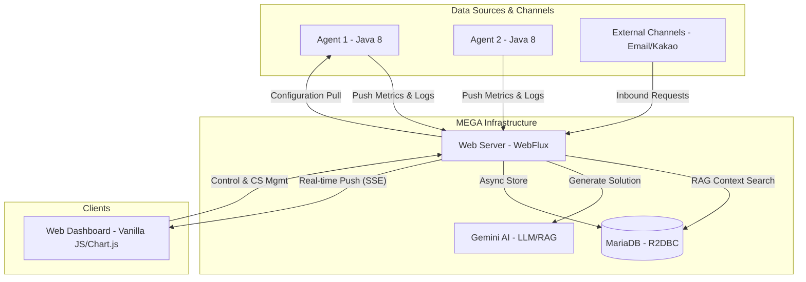
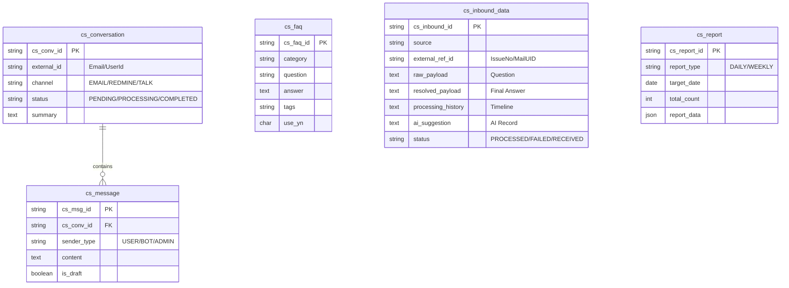

# MEGA (Monitoring & Error Gathering Agent) 🚀


**MEGA**는 분산 환경의 서버 자원과 애플리케이션 예외 로그를 실시간으로 통합 관리하는 **경량형 모니터링 시스템**입니다. 
리액티브 스택(WebFlux, R2DBC)을 활용하여 수많은 에이전트로부터의 데이터 유입을 낮은 오버헤드로 처리하며, SSE(Server-Sent Events)를 통해 대시보드에 깜박임 없는 실시간 지표를 제공합니다.

---

## 🏗 아키텍처 (Architecture)

MEGA는 **경량 에이전트(Agent)**와 **중앙 관리 서버(Web Server)**로 구성됩니다.



### 📊 데이터베이스 설계 (ER Diagram)

CS AI 자동화 시스템에서 사용하는 핵심 엔티티 간의 관계도입니다.



---

## ✨ 주요 기능 (Key Features)

### 🛰 Lightweight Agent
- **무설치형 구동**: Java 8 이상 환경이라면 어디서든 즉시 실행 가능한 Fat-JAR 및 Shell 스크립트 제공.
- **네이티브 수집**: 리눅스 표준 명령어(`top`, `/proc/stat`, `free`, `df`)를 직접 파싱하여 가장 정확한 OS 지표 수집.
- **로그 키워드 모니터링**: 애플리케이션 로그를 Real-time Tail 방식으로 감시하여 특정 키워드(Exception, Error 등) 발생 시 즉시 서버 전송.
- **동적 스케줄링**: 중앙 서버에서 설정한 모니터링 대상(Nginx, Docker 등)을 실시간으로 전달받아 수집 대상을 동적으로 변경.

### 🖥 Central Web Server
- **Full-Reactive Stack**: Spring WebFlux와 R2DBC(MariaDB)를 사용하여 대량의 스트리밍 데이터를 효율적으로 처리.
- **실시간 대시보드**: SSE 기술을 적용해 브라우저 새로고침 없이 차트와 지표가 실시간으로 업데이트.
- **차트 자동 생성**: 등록된 에이전트와 서비스별로 `Chart.js` 기반의 전용 대시보드가 자동으로 구성.
- **개별 차트 필터링**: 모든 차트가 하나에 묶이지 않고, 각 차트별로 별도의 시간 범위(실시간, 1h, 12h, 1d)를 설정하여 독립적인 분석 가능.
- **보안 및 인증**: API Key 기반 에이전트 인증 및 Spring Security를 통한 유저 접근 제어.

### 🤖 CS Automation Center (Intelligence)
- **TalkDream Domain Specific AI**: 톡드림(TalkDream) 메시징 포털 서비스에 최적화된 상담 로직(알림톡, SMS/LMS/MMS, RCS 부달 등) 제공.
- **RAG Context Enrichment**: 단순 FAQ를 넘어 과거 상담 이력(`cs_inbound_data`)과 연동하여 메시지 규격 및 전송 실패 원인 분석 가능.
- **AI-Powered Support**: Gemini API와 RAG 기술을 결합하여 실시간 고객 문의에 대한 전문적인 해결책 제시.
- **Auto-Seeding**: 서비스 시작 시 메시징 비즈니스에 필수적인 전문 FAQ 샘플이 자동으로 데이터베이스에 주입되어 즉시 활용 가능.

---

## 🛠 기술 스택 (Tech Stack)

| 구분 | 기술 |
| :--- | :--- |
| **Backend** | Java 21, Spring Boot 3.5.5, Spring WebFlux, Spring AI (Gemini) |
| **Database** | MariaDB, R2DBC, JDBC (for setup) |
| **Agent** | Java 8 (Compatibility), OkHttp 4, Gson, Logback |
| **Frontend** | Vanilla JS (ES6), Tailwind CSS (Optional), Chart.js, Thymeleaf |
| **Intelligence** | Gemini 1.5 Flash (LLM), RAG (Retrieval-Augmented Generation) |
| **Deployment** | Linux Shell Script, Nginx (Reverse Proxy) |

---

## 🚀 시작하기 (Quick Start)

### 1. 전제 조건 (Prerequisites)
- **Java**: Web Server(JDK 21+), Agent(JDK 1.8+)
- **Database**: MariaDB 10.x+
- **Database Setup**: [설치 가이드](./docs/INSTALL_AND_USE.md) 확인

### 2. 프로젝트 빌드 (Build)
```bash
# 전체 프로젝트 빌드
./gradlew build

# 에이전트 실행 가능 JAR 생성
./gradlew :agent:fatJar
```

### 3. 서버 및 에이전트 실행
- **Web Server**: `webserver/build/libs/` 내 JAR 파일 실행 또는 IDE에서 `WebServerApplication` 실행.
- **Agent**: `agent/` 디렉토리로 이동하여 설정 파일 수정 후 `./agent.sh start` 실행. (자세한 내용은 [Agent README](./agent/README.md) 참고)

---

## 📄 상세 문서 (Documentation)
궁금한 점이 있다면 상세 기술 문서를 참고하세요.
- 📘 [PRD (기획 문서)](./docs/PRD.md)
- 🏗 [Architecture (설계 구조)](./docs/ARCHITECTURE.md)
- 🍃 [Spring Boot Structure (프레임워크 구조)](./docs/SPRING_BOOT_STRUCTURE.md)
- 🛠 [Installation & Usage (설치 및 사용법)](./docs/INSTALL_AND_USE.md)
- 📝 [Logging Policy (로그 운영 정책)](./docs/LOGGING_POLICY.md)
- 📗 [CS AI 개발 가이드 (Development Guide)](./docs/CS_AI_DEVELOPMENT_GUIDE.md)
- 📊 [DB Design Guide (데이터베이스 설계 가이드)](./docs/DATABASE_DESIGN_GUIDE.md)
- 🤖 [AI Chatbot 위젯 구현 보고서](./docs/AI_CHATBOT_IMPLEMENTATION_REPORT.md)
- 🏗 [Coding & Dev Convention (개발 규약)](./docs/CODING_CONVENTION.md)
- 🤖 [Agent 가이드](./agent/README.md)

---

## 🤝 기여하기 (Contributing)
1. Fork the Project
2. Create your Feature Branch (`git checkout -b feature/AmazingFeature`)
3. Commit your Changes (`git commit -m 'Add some AmazingFeature'`)
4. Push to the Branch (`git push origin feature/AmazingFeature`)
5. Open a Pull Request

---
**MEGA**로 서버 관리를 더 스마트하고 실시간으로 경험해 보세요! 📈
