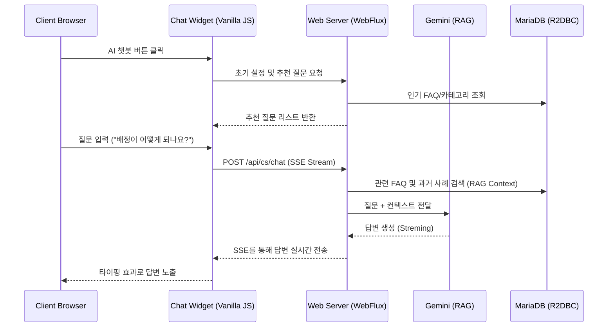

# LG AI 챗봇 분석 및 우리 시스템 구현 방안 보고서

이 문서는 LG전자 공식 사이트의 AI 챗봇 분석 결과와 이를 우리 **Mega CS AI 시스템**에 어떻게 접목하고 구현할 수 있는지에 대한 기술 분석을 담고 있습니다.

## 1. LG AI 챗봇 (LG AI Chat) 주요 특징 분석

LG전자의 AI 챗봇은 단순한 질의응답을 넘어 **커머스(제품 추천) + 고객 지원(AS 예약) + 개인화(보유 제품)**가 통합된 고도화된 인터페이스를 제공합니다.

### 1.1 UI/UX 특징
*   **플로팅 오버레이**: 웹사이트 우측 하단에 고정된 버튼을 통해 언제 어디서든 접근 가능.
*   **추천 질문(Quick Chips)**: "무선청소기 기능 요약", "혜택 안내" 등 사용자가 입력하기 전 미리 클릭할 수 있는 가이드라인 제공.
*   **카드형 인터페이스**: 제품 추천 시 이미지, 가격, 특징, 상세 보기 버튼이 포함된 가로 스크롤/슬라이드 형태의 리치 카드 제공.
*   **서비스 통합 메뉴**: 하단에 '스스로 해결하기', '출장 예약', '센터 찾기' 등 자주 찾는 전문 서비스 링크 배치.

### 1.2 기능적 특징
*   **Context-Aware RAG**: 사용자가 물어보는 제품군(TV, 냉장고 등)의 최신 정보를 데이터베이스에서 추출하여 AI가 답변 생성에 활용.
*   **개인화 서비스**: 로그인을 통해 사용자 계정과 연동하여 '내 보유 제품'에 대한 질문에 답변 가능.
*   **실시간 인터랙션**: 답변 생성 중 '응답 중지' 가능 및 자연스러운 스트리밍 방식의 텍스트 노출.

---

## 2. 우리 시스템(Mega CS AI)에서의 구현 가능성 분석

현재 우리 시스템은 이미 **Spring WebFlux(Reactive)**와 **Gemini AI(RAG)**를 기반으로 구축되어 있어, LG 챗봇 수준의 기능을 충분히 구현할 수 있는 기반을 갖추고 있습니다.

### 2.1 구현 가능 항목 (현재 기술 스택 활용)
1.  **AI 답변 및 RAG 통합**: 
    *   이미 구현된 `CsBotService`와 `CsFaqRepository`를 통해 질문에 맞는 최적의 답변을 생성할 수 있습니다.
    *   `CsInboundData`에 쌓인 성공 사례를 활용해 LG처럼 정확한 답변 초안 작성이 가능합니다.
2.  **실시간 통신**:
    *   현재 어드민에서 사용 중인 **SSE(Server-Sent Events)** 기술을 클라이언트 채용 위젯에 적용하여 실시간 대화를 구현할 수 있습니다.
3.  **추천 질문(Quick FAQ)**:
    *   `CsFaq` 테이블의 조회수나 인기 카테고리를 기반으로 상단에 추천 질문 버튼을 동적으로 생성할 수 있습니다.

### 2.2 추가 개발 필요 항목 (고도화 과제)
1.  **프론트엔드 위젯 (Widget Engine)**:
    *   현재의 대시보드 형태가 아닌, 모든 페이지에 임베딩 가능한 **플로팅 위젯(JS 라이브러리)** 개발 필요.
    *   Vanilla JS와 CSS를 활용해 경량화된 챗 창 UI 구축.
2.  **리치 카드 UI (Rich Components)**:
    *   텍스트 답변뿐만 아니라, 제품 정보나 서비스 링크를 카드 형태로 렌더링할 수 있는 프론트엔드 컴포넌트 라이브러리 구축.
3.  **외부 서비스 연동 (Service Hub)**:
    *   현재 `Service Management` 테이블과 연동하여 '담당자 연결', '일감 확인' 등을 챗봇 안에서 즉시 처리할 수 있는 연동 로직 추가.

---

## 3. 구현 아키텍처 제안 (Proposed Architecture)

---

## 4. 결론 및 향후 계획

LG 챗봇의 핵심은 **"데이터(RAG)"**와 **"UI(위젯)"**의 결합입니다. 우리 시스템은 이미 강력한 데이터 처리 및 AI 엔진을 보유하고 있으므로, **플로팅 위젯 UI**만 추가로 개발한다면 LG 수준의 AI 고객 지원 환경을 바로 구축할 수 있습니다.

### 다음 단계 제안:
1.  **디자인 시안 제작**: LG 챗봇 스타일의 플로팅 위젯 디자인(UI Mockup) 제작.
2.  **위젯 전용 API 구축**: 대화 세션을 유지하고 SSE를 통해 소통하는 경량 API(`CsChatController`) 증설.
3.  **임베딩 스크립트 배포**: 어느 사이트에서나 `<script src="...">` 한 줄로 챗봇을 추가할 수 있는 배포 체계 마련.
