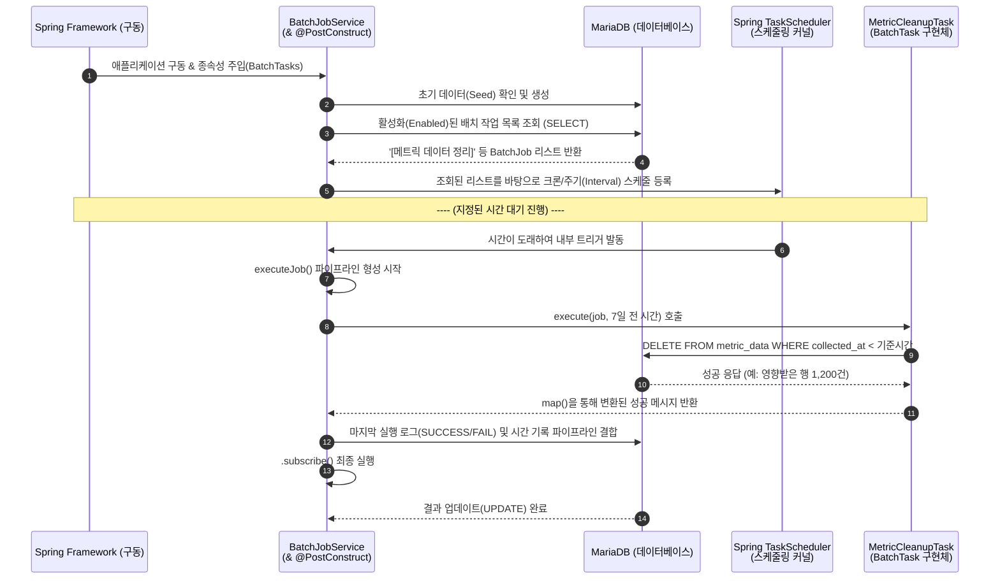

# 🕒 MEGA 배치 스케줄러 소스 레벨 분석 가이드 (Batch Scheduler Source-Level Guide)

본 문서는 MEGA 시스템에서 사용하는 **동적 배치 스케줄러**가 Spring Boot 내부에서 어떠한 과정과 순서로 동작하는지, 실제 소스 코드를 바탕으로 호출 단계별로 심층 분석한 가이드입니다.

---

## 1. 배치 스케줄러 기동 단계 (Startup Flow)

Spring Boot 애플리케이션이 구동되면서 스케줄러가 초기화되고 DB의 설정을 읽어오는 과정입니다.

### 1-1. 컴포넌트 자동 탐색 및 주입 (Dependency Injection)

```java
@Service
public class BatchJobService {
    // 주입된 BatchTask들의 구현체를 저장할 Map 공간
    private final Map<String, BatchTask> tasks = new ConcurrentHashMap<>();

    /** 
     * Spring 컨테이너가 기동될 때 호출됩니다.
     * 인터페이스(BatchTask)를 구현한 모든 클래스(예: MetricCleanupTask)를 List 형태로 자동 주입받습니다.
     */
    @Autowired
    public void setBatchTasks(List<BatchTask> taskList) {
        taskList.forEach(task -> {
            // "METRIC_DATA_CLEANUP" 같은 고유 코드를 key로, 실제 객체를 value로 저장
            tasks.put(task.getJobType(), task);
        });
    }
}
```

### 1-2. 스케줄러 초기화 (@PostConstruct)

```java
@PostConstruct
public void init() {
    log.info("[BatchJob] 배치 스케줄러 초기화 시작...");
    
    // 1️⃣ DB에 아무런 Job 데이터가 없으면 최초 설정(60분, 7일 보존 등)을 DB에 저장(Seed)
    seedDefaultJobsIfEmpty()
            // 2️⃣ DB에서 '활성화(enabled=true)' 상태인 모든 Job 데이터를 알파벳 순으로 가져오기
            .thenMany(batchJobRepository.findByEnabledTrueOrderByJobNameAsc())
            // 3️⃣ DB에서 조회된 각각의 Job마다 scheduleJob() 메서드를 호출하여 스프링 스케줄러에 등록
            .doOnNext(this::scheduleJob)
            // 4️⃣ 모든 초기화 과정이 끝나면 최종적으로 구독(subscribe)하여 실행 트리거
            .subscribe();
}
```

---

## 2. 작업 스케줄링 등록 (Scheduling Flow)

`init()` 에서 조회되어 넘어온 개별 `BatchJob` 객체를 메모리 내의 `TaskScheduler`에 위임하는 단계입니다.

```java
private void scheduleJob(BatchJob job) {
    ScheduledFuture<?> future;
    
    // 💡 크론(Cron) 표현식이 우선순위가 더 높습니다.
    if (job.getCronExpression() != null && !job.getCronExpression().trim().isEmpty()) {
        future = taskScheduler.schedule(
            () -> executeJob(job).subscribe(), // 스케줄 시간이 되면 executeJob을 실행
            new CronTrigger(job.getCronExpression())
        );
    } 
    // 크론이 없고 주기(Interval, 분 단위)가 설정된 경우
    else if (job.getIntervalMinutes() != null && job.getIntervalMinutes() > 0) {
        Duration duration = Duration.ofMinutes(job.getIntervalMinutes());
        future = taskScheduler.scheduleAtFixedRate(
            () -> executeJob(job).subscribe(), 
            duration
        );
    } 
    
    // 향후 수정/삭제/비활성화 시 스케줄을 취소할 수 있도록 Map에 보관
    scheduledFutures.put(job.getBatchJobId(), future);
}
```

---

## 3. 실제 작업 실행 및 모니터링 결합 (Execution Flow)

지정된 시간이 도래하여 Spring `TaskScheduler`가 실제 작업을 실행하는 단계입니다.

```java
private Mono<String> executeJob(BatchJob job) {
    // 1️⃣ 보존 기간(예: 7일)을 계산하여 '삭제 기준일(threshold)'을 만듭니다.
    int retentionDays = job.getRetentionDays() != null ? job.getRetentionDays() : 0;
    LocalDateTime threshold = LocalDateTime.now().minusDays(retentionDays);

    // 2️⃣ 미리 담아두었던 Map에서 실행할 객체(예: MetricCleanupTask)를 깨웁니다.
    BatchTask task = tasks.get(job.getJobType());
    
    // 3️⃣ 실제 로직 실행: task.execute()는 R2DBC 비동기 쿼리 시작 역할을 합니다.
    return task.execute(job, threshold)
            
            // 4️⃣ [성공 시] DB 비동기 작업이 완료되면 넘어오는 결과 메시지를 받습니다.
            .flatMap(msg -> {
                // MariaDB의 batch_job 테이블에 마지막 실행 상태를 'SUCCESS'와 메시지로 기록
                return batchJobRepository.updateRunResult(job.getBatchJobId(), LocalDateTime.now(), "SUCCESS", msg)
                        .thenReturn(msg);
            })
            // 5️⃣ [실패 시] 만약 작업 중 익셉션(Exception)이 터지면 여기로 떨어집니다.
            .onErrorResume(e -> {
                String errMsg = "실행 실패: " + e.getMessage();
                // 장애 상태를 파악할 수 있도록 'FAILED' 상태와 에러 메시지를 DB에 기록
                return batchJobRepository.updateRunResult(job.getBatchJobId(), LocalDateTime.now(), "FAILED", errMsg)
                        .thenReturn(errMsg);
            });
}
```

---

## 4. 개별 구현체 로직 (`MetricCleanupTask.java`)

`executeJob()`이 호출한 구체적인 비즈니스 로직(실제 DB 정리 작업) 부분입니다.

```java
@Override
public Mono<String> execute(BatchJob job, LocalDateTime threshold) {
    // 1️⃣ 리포지토리를 호출하여 threshold(기준 시간) 이전의 데이터를 삭제 요청
    return metricDataRepository.deleteByCollectedAtBefore(threshold)
            
            // 2️⃣ 삭제 완료 후 MariaDB에서 '몇 건을 지웠는지(deleted)' 응답을 주면
            //    문자열(String)로 이쁘게 가공하여 상위 서비스(BatchJobService)로 던져줌
            .map(deleted -> String.format("Metric cleanup 완료: %d건 삭제 (기준: %s 이전)", 
                    deleted, threshold.toLocalDate()));
}
```

---

## 5. 소스 기반 호출 순서도 (Call Flow Sequence)

애플리케이션이 뜨고 스케줄러가 작동하면서 쿼리가 수행되고 저장되기까지의 일련의 시간 흐름도입니다.



---
**문서 작성일**: 2026.03.27  
**작성자**: Antigravity (AI Assistant)
