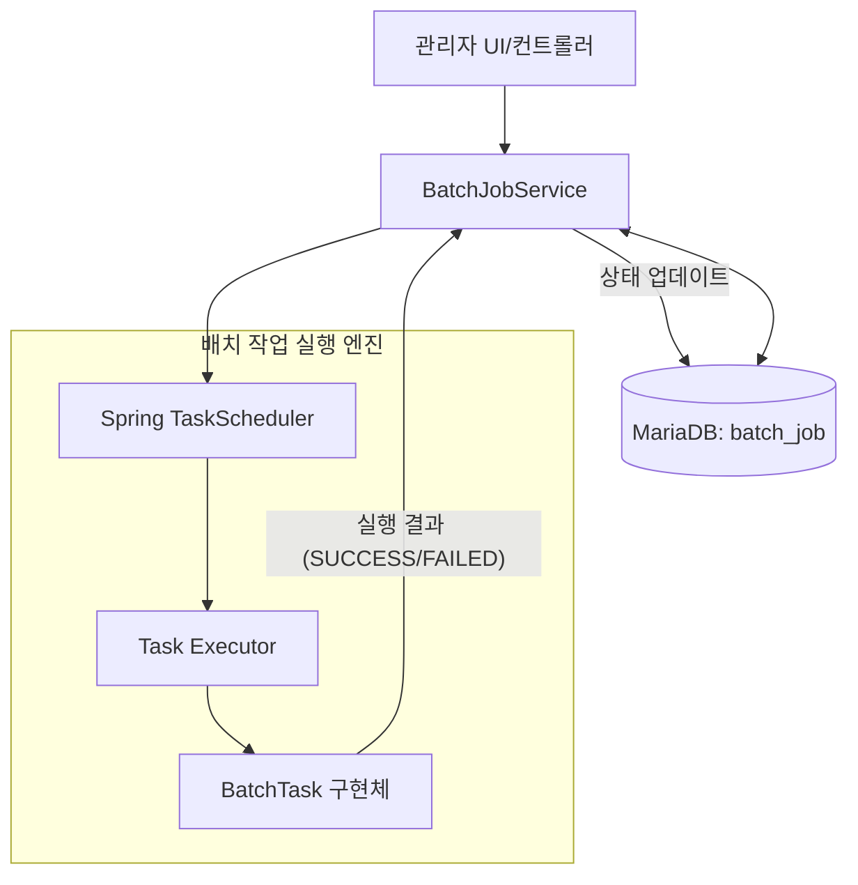

# 🕒 MEGA 배치 스케줄러 가이드 (Batch Scheduler Guide)

본 문서는 MEGA 시스템에서 주기적인 데이터 정리, 통계 집계, 알림 등 백그라운드 작업을 효율적으로 관리하기 위해 구축된 **동적 배치 스케줄러**의 설계 및 사용 방법을 설명합니다.

---

## 1. 개요 및 설계 목표
기존의 정적인 `@Scheduled` 방식은 설정 변경 시 서버 재시작이 필요하지만, MEGA 배치 스케줄러는 다음과 같은 목표로 설계되었습니다.
*   **동적 스케줄링**: 서버 실행 중에도 UI를 통해 주기(Interval)나 Cron 표현식을 실시간으로 변경 가능.
*   **작업 관리 및 모니터링**: 개별 작업의 활성화 여부, 마지막 실행 시간, 성공/실패 여부 및 결과 메시지를 DB에서 관리.
*   **확장성 (Strategy Pattern)**: `BatchTask` 인터페이스를 구현하는 것만으로 새로운 배치 작업을 쉽게 추가 가능.

---

## 2. 시스템 구조 및 흐름

### 2.1 아키텍처 다이어그램


### 2.2 핵심 클래스 설명
*   **BatchJob (Entity)**: DB의 `batch_job` 테이블과 매핑되어 작업의 이름, 유형, 주기, 상태 등을 저장.
*   **BatchJobService (Engine)**: 서버 구동 시(`@PostConstruct`) 활성화된 작업을 로드하고, `TaskScheduler`를 이용해 실제 스케줄을 등록/취소/변경하는 핵심 브레인.
*   **BatchTask (Interface)**: 실질적인 배치 로직을 정의하는 규격. 각 구현체는 `@Component`로 등록되어 자동으로 서비스에 주입됨.

---

## 3. 주요 기능 및 설정 방법

### 3.1 스케줄링 방식
두 가지 방식을 모두 지원하며, `cron_expression`이 설정되어 있으면 우선 적용됩니다.
1.  **Fixed Interval**: 분(minutes) 단위로 설정 가능 (예: 60분마다 실행).
2.  **Cron Expression**: 복잡한 주기 설정 지원 (예: `0 0 23 * * ?` - 매일 밤 11시).

### 3.2 기본 제공 배치 작업 (Seeded Tasks)
시스템 초기 구동 시 다음 작업들이 기본으로 생성됩니다.
*   **메트릭 데이터 정리**: 보존 기간(`retentionDays`, 기본 7일)이 지난 `metric_data`를 자동 삭제.
*   **Exception 로그 정리**: 보존 기간(기본 30일)이 지난 `exception_log`를 자동 삭제.

---

## 4. 새로운 배치 작업 추가 가이드 (Developer)

새로운 정기 작업을 추가하려면 다음 단계를 따릅니다.

### Step 1: `BatchTask` 인터페이스 구현
```java
@Component
public class MyNewTask implements BatchTask {
    @Override
    public String getJobType() { return "MY_NEW_TASK"; } // 고유 식별자

    @Override
    public String getDisplayName() { return "나의 새로운 작업"; }

    @Override
    public Mono<String> execute(BatchJob job, LocalDateTime threshold) {
        // 실제 로직 구현 (예: 특정 테이블 백업 등)
        return Mono.just("작업 완료 메시지");
    }
}
```

### Step 2: 관리자 화면에서 등록
1.  관리자 설정 메뉴의 **배치 작업 관리**로 이동합니다.
2.  `+ 추가` 버튼을 눌러 작업 이름을 입력하고, 유형에서 `나의 새로운 작업`을 선택합니다.
3.  주기(분) 또는 Cron 식을 입력하고 저장하면 즉시 스케줄링이 시작됩니다.

---

## 5. 운영 현황 모니터링
*   **로그**: `[BatchJob] 실행 시작: type=..., name=...` 패턴으로 로그가 기록됩니다.
*   **DB 확인**: `batch_job` 테이블의 `last_run_status`와 `last_run_message`를 통해 장애 발생 여부를 신속히 파악할 수 있습니다.

---
**문서 작성일**: 2026.03.27  
**작성자**: Antigravity (AI Assistant)
