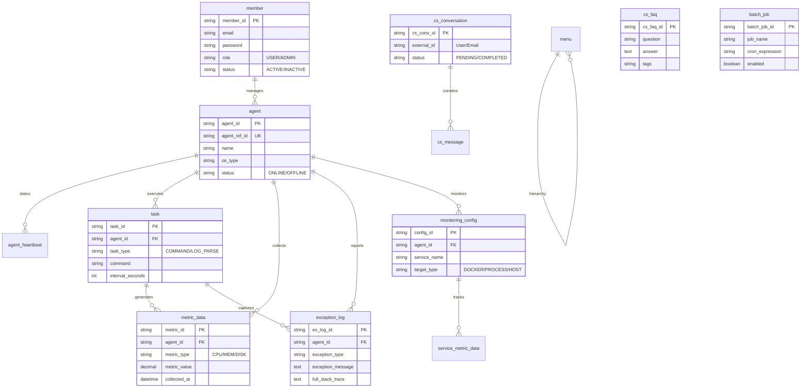

# MEGA 시스템 전체 데이터베이스 설계 가이드 (Full ERD)

이 문서는 MEGA(Monitoring & Error Gathering Agent) 프로젝트에서 사용하는 **전체 테이블 구조**와 각 도메인별 관계 모델을 상세히 설명합니다.

---

## 1. 전사 ER 다이어그램 (Global ER Diagram)

시스템 전체의 핵심 엔티티 간 연결 관계를 보여줍니다.

---

## 2. 모듈별 상세 설계 (Domain Specific)

### 2.1 코어 및 모니터링 모듈 (Core & Monitoring)
에이전트의 상태와 서버 리소스 지표를 관리하는 핵심 테이블입니다.

*   **`member`**: 시스템 관리자 및 사용자 계정 정보.
*   **`agent`**: 원격지에 설치된 에이전트 식별 및 상태 관리.
*   **`agent_heartbeat`**: 실시간 연결 유지를 위한 하드비트 로그.
*   **`metric_data`**: CPU, Memory, Disk 등 시계열 메트릭 데이터.
*   **`exception_log`**: 에이전트에서 감지된 애플리케이션 예외(Stack Trace).

### 2.2 작업 및 스케줄러 모듈 (Task & Scheduler)
반복적인 작업 수행과 배치 프로세스를 관리합니다.

*   **`task`**: 에이전트별 실행 작업(명령어 실행, 로그 파싱 등) 설정.
*   **`batch_job`**: 서버 사이드 주기적 작업(데이터 정리, 리포트 생성 등) 정보.

### 2.3 서비스 모니터링 모듈 (Service Monitoring)
특정 애플리케이션(Nginx, Docker 컨테이너 등) 단위의 집중 모니터링을 담당합니다.

*   **`monitoring_config`**: 모니터링 대상 서비스 식별 및 수집 항목 설정.
*   **`service_metric_data`**: 개별 서비스 전용 메트릭(프로세스별 점유율 등) 데이터.

### 2.4 CS AI 자동화 모듈 (CS AI Automation)
고객 문의 처리 및 AI 기반 자동 응답 시스템입니다.

*   **`cs_faq`**: AI 답변의 근거가 되는 표준 지식 베이스.
*   **`cs_inbound_data`**: 외부 유입된 문의 원본과 최종 해결 이력(RAG 학습 원천).
*   **`cs_conversation`**: 사용자별 상담 세션(채팅방 개념) 관리.
*   **`cs_message`**: 세션 내에서 오고 간 실제 대화 및 AI 답변 초안.
*   **`cs_report`**: 상담 결과 통계 데이터.

---

## 3. 핵심 관계 설명 (Core Relationships)

1.  **Agent 중심 설계**: 모든 데이터(`metric_data`, `task`, `exception_log` 등)는 `agent_id`를 기준으로 정규화되어 있으며, 에이전트의 온라인 여부에 따라 데이터 수집이 제어됩니다.
2.  **RAG 기반 AI 연동**: `cs_faq`와 `cs_inbound_data`는 서로 다른 목적으로 사용되지만, 상담 답변 생성 시 AI가 두 테이블을 동시에 검색(Union Search)하여 가장 적절한 답변을 도출합니다.
3.  **계층형 메뉴**: `menu` 테이블의 `parent_id`를 통해 어드민 대시보드의 다단계 메뉴 구조를 재귀적으로 지원합니다.

---

## 4. 인덱스 최적화 전략

*   **시계열 검색**: `collected_at`, `occurred_at` 컬럼에 인덱스를 부여하여 대시보드의 실시간 차트 조회를 최적화합니다.
*   **고유 식별**: `agent_ref_id`와 같은 비즈니스 고유 키에는 `Unique Index`를 적용하여 데이터 정합성을 보장합니다.
*   **자연어 검색**: `cs_faq`와 `cs_inbound_data`의 텍스트 컬럼은 형태소 분석을 통한 전문 검색(Full-text Search)을 지원하도록 설계되었습니다.
