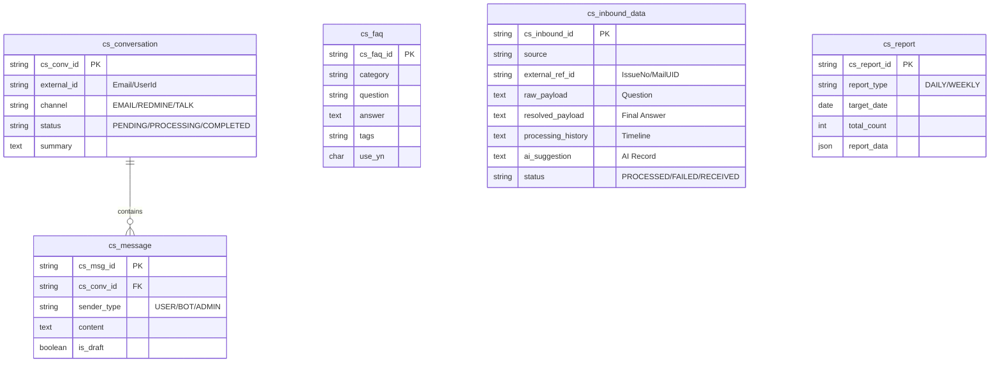

# CS AI 자동화 시스템 데이터베이스 설계 가이드

이 문서는 CS(Customer Service) 자동화 및 AI 지원 시스템에서 사용하는 `cs_*` 관련 테이블의 구조와 역할을 설명합니다. 

## 1. 개요 (Architecture Overview)

본 시스템은 **RAG(Retrieval-Augmented Generation)** 아키텍처를 기반으로 하며, 다음과 같은 흐름으로 데이터를 관리합니다.

1.  **Staging**: 이메일, 레드마인 등에서 들어온 원본 데이터를 `cs_inbound_data`에 저장합니다.
2.  **Session**: 대화의 흐름을 `cs_conversation`과 `cs_message`로 관리합니다.
3.  **Knowledge**: `cs_faq`와 `cs_inbound_data`의 성공 사례를 AI가 학습 컨텍스트로 사용합니다.
4.  **Reporting**: 누적된 데이터를 `cs_report`로 통계화합니다.

---

## 2. ER 다이어그램 (Entity Relationship)

---

## 3. 테이블 상세 안내

### 3.1 `cs_faq` (지식 베이스 - 표준 답변)
AI가 직접 매칭하거나(Auto-Reply), 답변 초안을 작성할 때 가장 먼저 참고하는 **공식 가이드라인**입니다.

| 컬럼명 | 타입 | 설명 |
| :--- | :--- | :--- |
| `cs_faq_id` | VARCHAR(50) | PK (예: FAQ0000000001) |
| `category` | VARCHAR(50) | 배정, 장애, 단순문의 등 대분류 |
| `question` | VARCHAR(1000) | 예상 질문 내역 |
| `answer` | TEXT | 표준 답변 내용 |
| `tags` | VARCHAR(500) | 검색 엔진(Fulltext Index)용 키워드 |
| `use_yn` | CHAR(1) | 사용 여부 (Y/N) |

### 3.2 `cs_inbound_data` (수집 데이터 - 사례 학습)
이메일, 레드마인 등 외부 시스템에서 유입된 **Raw 데이터 및 최종 해결 이력**을 저장합니다.

| 컬럼명 | 타입 | 설명 |
| :--- | :--- | :--- |
| `cs_inbound_id` | VARCHAR(50) | PK (예: INB0000000001) |
| `source` | VARCHAR(20) | 데이터 출처 (EMAIL, REDMINE, TALKDREAM) |
| `external_ref_id` | VARCHAR(100) | 레드마인 일감번호, 메일 UID 등 외부 참조 ID |
| `raw_payload` | LONGTEXT | 고객이 보낸 **최초 문의 본문** |
| `resolved_payload` | LONGTEXT | 상담사가 발송한 **최종 해결 답변** (RAG의 핵심) |
| `processing_history` | LONGTEXT | 레드마인 댓글 스레드 등 **처리 과정 전체 히스토리** |
| `ai_suggestion` | LONGTEXT | AI가 추천했던 **모범 답변 기록** (감사/대조 용도) |
| `status` | VARCHAR(20) | **PROCESSED(학습대상)**, RECEIVED, FAILED |

> [!TIP]
> **RAG (현행화 학습)**: `status`가 `PROCESSED`인 데이터는 AI가 답변 초안을 작성할 때 "과거 사례"로서 검색 대상이 되어 답변 품질을 비약적으로 높여줍니다.

### 3.3 `cs_conversation` (상담 세션 관리)
채널에 관계없이 특정 사용자(`external_id`)와 진행 중인 **상담 흐름을 그룹화**합니다.

| 컬럼명 | 타입 | 설명 |
| :--- | :--- | :--- |
| `cs_conv_id` | VARCHAR(50) | PK (예: CON0000000001) |
| `external_id` | VARCHAR(255) | 톡드림 ID, 이메일 주소 등 발신자 유일 식별값 |
| `status` | VARCHAR(20) | PENDING(대기), PROCESSING(진행), COMPLETED(완료) |
| `summary` | TEXT | AI가 대화 종료 후 요약한 상담 핵심 내용 |

### 3.4 `cs_message` (대화 상세 내역)
세션 내에서 오고 간 **개별 메시지**를 저장합니다.

| 컬럼명 | 타입 | 설명 |
| :--- | :--- | :--- |
| `cs_msg_id` | VARCHAR(50) | PK (예: MSG0000000001) |
| `cs_conv_id` | VARCHAR(50) | FK (`cs_conversation` 참조) |
| `sender_type` | VARCHAR(20) | USER(고객), BOT(AI), ADMIN(상담사) |
| `is_draft` | BOOLEAN | AI가 작성한 **초안(Draft)** 여부 (상담사 전용) |

### 3.5 `cs_report` (운영 통계)
상담 처리 결과에 대한 주기적 통계 데이터를 저장합니다.

| 컬럼명 | 타입 | 설명 |
| :--- | :--- | :--- |
| `cs_report_id` | VARCHAR(50) | PK (예: RPT0000000001) |
| `report_type` | VARCHAR(20) | DAILY, WEEKLY, MONTHLY |
| `total_count` | INT | 해당 기간의 총 문의 건수 |
| `report_data` | JSON | 고객사별, 유형별 상세 통계 수치 (JSON 포맷) |

---

## 4. 인덱스 및 검색 전략

1.  **Fulltext Index**: `cs_faq`의 (question, answer, tags) 컬럼에 적용되어 자연어 검색을 지원합니다.
2.  **RAG Search**: `cs_inbound_data`에서 `raw_payload`를 `LIKE` 연산으로 검색하여 유사 사례를 추출합니다.
3.  **Session Index**: `external_id`와 `status`에 인덱스가 걸려 있어 진행 중인 상담 세션을 빠르게 조회합니다.
