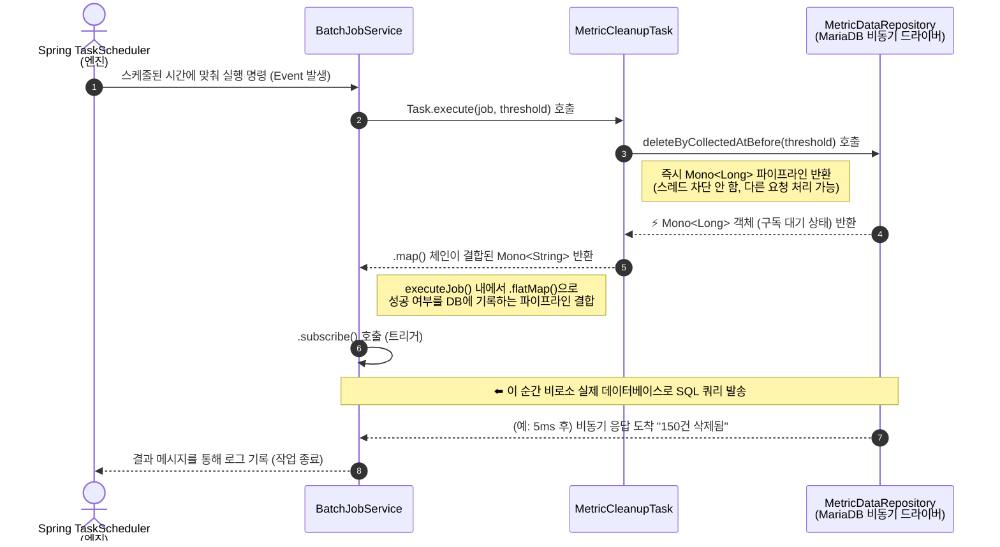

# 🌊 Reactive (초급~중급) 학습 가이드: MEGA 배치 스케줄러 편

현재 사용하고 계신 MEGA 프로젝트는 **Spring WebFlux(Reactive Programming)**를 채택하고 있습니다. 
이 문서는 기본 배치 작업 중 하나인 **'메트릭 데이터 정리(MetricCleanupTask)'**와 관리 서비스(`BatchJobService`)의 코드를 기준으로, **리액티브의 핵심 원리(Mono/Flux)**를 쉽게 파악할 수 있도록 구성된 학습 가이드입니다.

---

## 1. 리액티브 프로그래밍의 핵심 개념

기존의 Spring MVC(동기, Blocking)와 WebFlux(비동기, Non-Blocking)의 가장 큰 차이는 **"결과를 기다리지 않고 다른 일을 하다가, 결과가 준비되면(Event) 통보받아(Subscribe) 처리한다"**는 점입니다.

이를 위해 두 가지 핵심 타입(Publisher)을 사용합니다:
*   `Mono<T>`: **0개 또는 1개**의 결과를 반환할 때 사용. (예: 단건 조회, 저장 성공/실패, 삭제 작업)
*   `Flux<T>`: **0개부터 N개(무한대 포함)**의 결과를 반환할 때 사용. (예: 리스트 조회, 스트리밍)

---

## 2. 코드 분석: 메트릭 데이터 정리 (MetricCleanupTask)

먼저, 설정된 보존 기간 이전의 낡은 데이터를 삭제하는 스케줄러 작업의 실제 코드입니다.

```java
package led.mega.batch.task;

import led.mega.batch.entity.BatchJob;
import led.mega.repository.MetricDataRepository;
import lombok.RequiredArgsConstructor;
import lombok.extern.slf4j.Slf4j;
import org.springframework.stereotype.Component;
import reactor.core.publisher.Mono;

import java.time.LocalDateTime;

@Slf4j
@Component
@RequiredArgsConstructor
public class MetricCleanupTask implements BatchTask {

    // R2DBC 기반의 리액티브 데이터베이스 리포지토리
    private final MetricDataRepository metricDataRepository;

    @Override
    public String getJobType() {
        return "METRIC_DATA_CLEANUP";
    }

    @Override
    public String getDisplayName() {
        return "메트릭 데이터 정리 (DB 삭제)";
    }

    /**
     * @param job : 실행할 배치 정보
     * @param threshold : 이 시간 이전의 데이터를 삭제 (예: 7일 전)
     * @return Mono<String> : 작업 완료 후 결과 메시지 (1개의 결과)
     */
    @Override
    public Mono<String> execute(BatchJob job, LocalDateTime threshold) {
        
        /* 
         * 1단계: metricDataRepository.deleteByCollectedAtBefore(threshold)
         * - (DB 작업) 조건에 맞는 데이터를 비동기적으로 삭제합니다. 
         * - 삭제가 완료되면, 데이터베이스는 몇 건이 삭제되었는지(정수형 숫자)를 응답합니다.
         * - 반환 타입: Mono<Long> (또는 Mono<Integer>)
         *   🚨 주의: 여기서 삭제 명령을 내린 후 "스레드는 멈춰서 기다리지 않습니다".
         */
        return metricDataRepository.deleteByCollectedAtBefore(threshold)
                
                /*
                 * 2단계: .map()
                 * - DB 삭제 응답(deleted 건수)이 도착했을 때, 이 값을 다른 형태(String)로 변환합니다.
                 * - Java Stream의 map()과 비슷하지만, 시간의 흐름(이벤트) 위에서 동작합니다.
                 * - 반환 타입: Mono<String>
                 */
                .map(deleted -> String.format("Metric cleanup 완료: %d건 삭제 (기준: %s 이전)", 
                        deleted, threshold.toLocalDate()));
    }
}
```

---

## 3. 리액티브 데이터 파이프라인 흐름도 (Sequence Diagram)

스케줄러에서 위의 작업(Task)을 호출하고 결과를 DB에 업데이트하는 전체 파이프라인을 시각화하면 다음과 같습니다.



### 💡 흐름 핵심 포인트
1. **조립 단계 (Assembly)**: `execute` 메서드 안의 코드는 실행 즉시 DB에 쿼리를 날리는 것이 아닙니다. **"이런 순서로 작업할 거야"**라는 계획서(파이프라인)를 만드는 과정입니다.
2. **비동기성 (Non-Blocking)**: DB에 삭제 요청을 보낸 후 서버의 스레드(Thread)는 멈춰있지 않습니다. 응답이 올 때까지 다른 웹 요청을 처리하러 갑니다.
3. **구독 (Subscribe)**: 최종적으로 누군가가(스케줄러 엔진) 파이프라인의 끝에서 `.subscribe()`를 호출해야만 물(데이터)이 흐르며 실제로 작업이 시작됩니다.

---

## 4. 응용: BatchJobService의 flatMap 관찰하기

실제 이 작업의 응답 흐름을 처리하는 `BatchJobService.executeJob` 메서드를 약간 축약하여 보겠습니다.

```java
// BatchJobService.java 내부
private Mono<String> executeJob(BatchJob job) {
    // 1. Task 객체 불러오기
    BatchTask task = tasks.get(job.getJobType()); 
    
    // 2. 비동기 Task 실행 시작 (Mono<String> 반환됨)
    return task.execute(job, threshold)
            
            /*
             * flatMap:
             * Task에서 삭제가 완료되고 결과 메시지(msg)가 도착하면 실행됩니다.
             * 여기서 메시지를 리턴하는 게 아니라, '결과를 DB에 업데이트하는 새로운 비동기 작업(updateRunResult)'으로
             * 파이프라인을 이어붙여 확장합니다.
             */
            .flatMap(msg -> {
                log.info("[BatchJob] {}", msg); // 로그 출력
                
                // 실행 상태(SUCCESS)를 DB에 남기는 작업. 결과로는 다시 원래의 msg를 Mono로 포장하여 반환
                return batchJobRepository.updateRunResult(job.getBatchJobId(), LocalDateTime.now(), "SUCCESS", msg)
                        .thenReturn(msg); 
            })
            
            /*
             * onErrorResume:
             * 파이프라인 어디선가(삭제 중이든, 결과 업데이트 중이든) 에러가 발생하면,
             * 프로그램이 죽지 않고 이곳을 타게 됩니다. (try-catch와 유사)
             * 실패 상태(FAILED)를 DB에 남기고, 에러 메시지를 반환하도록 복구합니다.
             */
            .onErrorResume(e -> {
                String errMsg = "실행 실패: " + e.getMessage();
                log.error("[BatchJob] 실행 오류", e);
                return batchJobRepository.updateRunResult(job.getBatchJobId(), LocalDateTime.now(), "FAILED", errMsg)
                        .thenReturn(errMsg);
            });
}
```

### 🎯 핵심 요약
*   **`.map(...)`**: 들어온 데이터(비동기 응답) 모양을 단순 변형할 때 사용 (동기적 변환)
*   **`.flatMap(...)`**: 들어온 데이터를 가지고 **또 다른 비동기 작업(DB I/O, API 통신 등)**을 수행할 때 사용. (파이프라인 확장)

이 가이드를 통해 리액티브(WebFlux) 특유의 파이프라인 조립(Assembly)과 연산 체이닝(map, flatMap)의 개념을 더 명확하게 이해하실 수 있기를 바랍니다!
