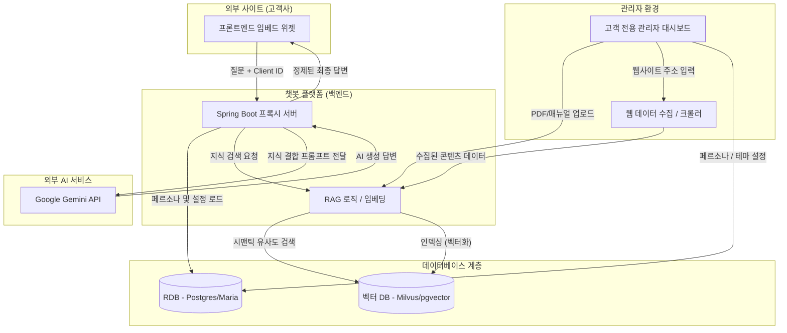
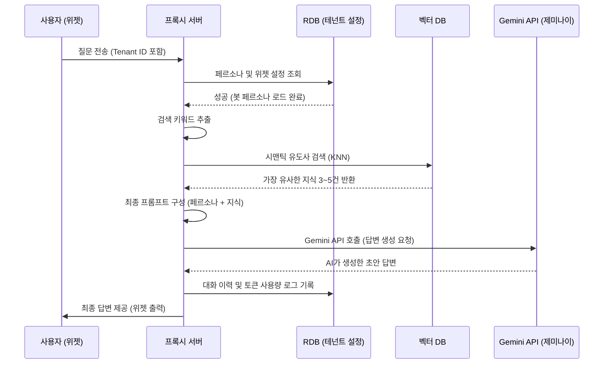

# 챗봇 빌더 시스템 아키텍처 다이어그램

## 1. 전체 시스템 데이터 흐름도

## 2. 실시간 RAG 시퀀스 다이어그램

## 3. 아키텍처 주요 구성 요소 설명

- **프론트엔드 위젯 (JS Snippet)**: 고객사 웹사이트에 삽입되는 가벼운 임베드 스크립트입니다.
- **프록시 서버 (Spring Boot)**: API 키 보안 관리 및 RAG 워크플로우를 관장하는 중앙 컨트롤러입니다.
- **RDB (Postgres/Maria)**: 테넌트 설정, 시스템 프롬프트(페르소나), 대화 통계 데이터를 저장합니다.
- **벡터 DB**: 벡터화된 문서 데이터의 고속 유사도 검색을 위한 특화 데이터베이스입니다.
- **웹 크롤러**: 고객사 웹사이트 URL로부터 지식을 주기적/실시간으로 수집하는 엔진입니다.
