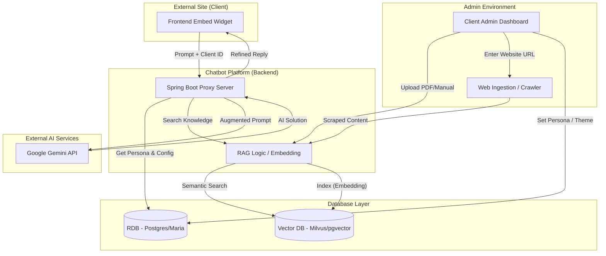
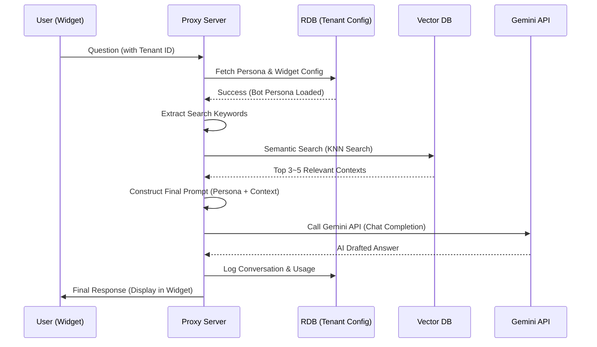

# Chatbot Builder System Architecture Diagram

## 1. Overall System Data Flow

```mermaid
graph TD
    subgraph "External Site (Client)"
        Widget[Frontend Embed Widget]
    end

    subgraph "Admin Environment"
        Admin[Client Admin Dashboard]
        Crawler[Web Ingestion / Crawler]
    end

    subgraph "Chatbot Platform (Backend)"
        Proxy[Spring Boot Proxy Server]
        RAG[RAG Logic / Embedding]
    end

    subgraph "Database Layer"
        RDB[(RDB - Postgres/Maria)]
        VDB[(Vector DB - Milvus/pgvector)]
    end

    subgraph "External AI Services"
        Gemini[Google Gemini API]
    end

    %% User Interaction Flow
    Widget -- "Prompt + Client ID" --> Proxy
    Proxy -- "Get Persona & Config" --> RDB
    Proxy -- "Search Knowledge" --> RAG
    RAG -- "Semantic Search" --> VDB
    Proxy -- "Augmented Prompt" --> Gemini
    Gemini -- "AI Solution" --> Proxy
    Proxy -- "Refined Reply" --> Widget

    %% Knowledge Base Flow (Admin)
    Admin -- "Upload PDF/Manual" --> RAG
    Admin -- "Enter Website URL" --> Crawler
    Crawler -- "Scraped Content" --> RAG
    RAG -- "Index (Embedding)" --> VDB
    
    %% Management Flow
    Admin -- "Set Persona / Theme" --> RDB
```

## 2. Real-time RAG Sequence Diagram

```mermaid
sequenceDiagram
    participant U as User (Widget)
    participant P as Proxy Server
    participant DB as RDB (Tenant Config)
    participant V as Vector DB
    participant AI as Gemini API

    U->>P: Question (with Tenant ID)
    P->>DB: Fetch Persona & Widget Config
    DB-->>P: Success (Bot Persona Loaded)
    
    P->>P: Extract Search Keywords
    P->>V: Semantic Search (KNN Search)
    V-->>P: Top 3~5 Relevant Contexts
    
    P->>P: Construct Final Prompt (Persona + Context)
    P->>AI: Call Gemini API (Chat Completion)
    AI-->>P: AI Drafted Answer
    
    P->>DB: Log Conversation & Usage
    P->>U: Final Response (Display in Widget)
```
