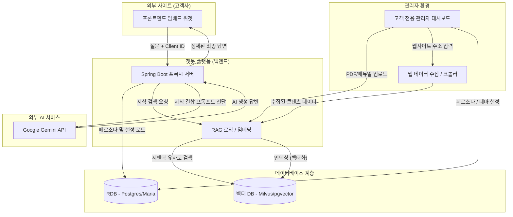
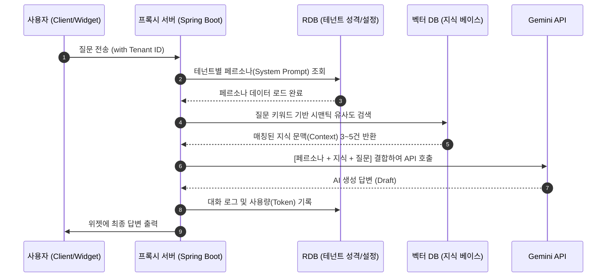
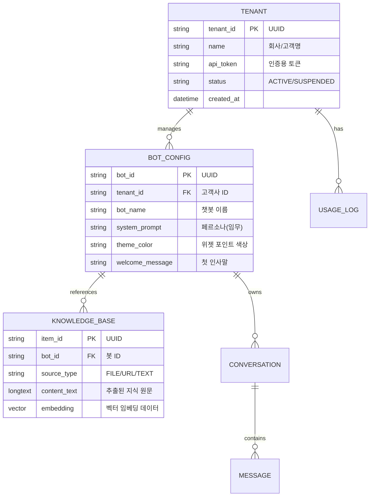
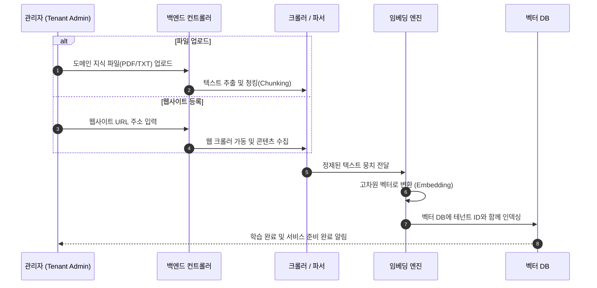

# B2B SaaS 챗봇 빌더 통합 상세 설계서 (Technical Spec)

본 문서는 고객사 맞춤형 RAG 기반 챗봇 서비스를 위한 B2B SaaS 플랫폼의 전체 아키텍처, 데이터 흐름, DB 설계 및 구현 계획을 통합하여 기술합니다.

---

## 1. 개요 및 목표
*   **목표**: 고객사가 고유한 프롬프트 및 RAG 학습 데이터를 기반으로 맞춤형 챗봇을 생성하고, JS 스니펫(Embed Code)을 자사 웹사이트에 연동하는 통합 플랫폼 구축.
*   **핵심 특징**: 중앙 집중형 API Key 관리(Proxy 서버), 테넌트별 데이터 격리, 실시간 RAG 지식 업데이트.

---

## 2. 시스템 아키텍처 및 데이터 흐름

### 2.1 전체 시스템 아키텍처

### 2.2 실시간 RAG 시퀀스 (고객 문의 처리)

---

## 3. 데이터베이스 설계 (ERD)

모든 테이블은 데이터 추적을 위해 **감사(Auditing) 컬럼**(`created_at`, `updated_at`, `created_by`, `updated_by`)을 공통으로 포함합니다.

---

## 4. 챗봇 생성 및 학습 흐름 (관리자용)

고객이 직접 지식을 학습시키고 챗봇을 커스터마이징하는 백엔드 내부 흐름입니다.

---

## 5. 단계별 구현 계획

### [Phase 1] 아키텍처 기초 및 DB 구축
- 멀티테넌트 지원을 위한 RDB/벡터 DB 스키마 생성 및 연동 구조 수립.
- 테넌트 식별을 위한 API 키 프록시 구조 설계.

### [Phase 2] 백엔드 코어 및 리얼타임 RAG 개발
- Spring Boot 기반의 Gemini API 대리 호출(Proxy) 모듈 구축.
- **Web Ingestion Engine**: 특정 URL 입력 시 자동으로 크롤링하여 지식화하는 파이프라인.
- 테넌트별 동적 프롬프트 로딩 및 지식 기반 답변 생성 로직.

### [Phase 3] 관리자 대시보드 및 위젯 개발
- 고객사용 챗봇 생성 UI, 프롬프트 에디터, 지식 관리 화면 개발.
- 외부 웹사이트 임베드용 `chatbot-widget.js` SDK 및 보안 통신 적용.
- 사용량(Token) 집계 및 과금 관리 통계 제공.

---
**설명**:
이 통합 문서는 `CHATBOT_BUILDER_ARCHITECTURE`, `DIAGRAM`, `SOURCE_FLOW`, `ER_DIAGRAM` 등을 하나로 합친 최종 스펙 문서입니다. 이후 작업은 이 문서를 기준으로 진행됩니다.
