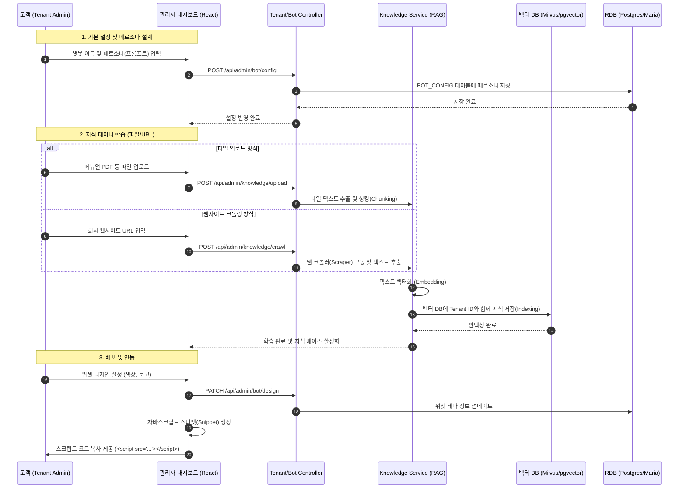

# 챗봇 커스터마이징 및 생성 흐름도 (관리자용)

고객(테넌트)이 우리 사이트(Admin Dashboard)에 접속하여 자신만의 맞춤형 챗봇을 설계하고 배포하는 구체적인 과정입니다.

## 1. 단계별 생성 및 학습 흐름 (Sequence Diagram)

## 2. 주요 단계별 처리 데이터

| 단계 | 입력 데이터 (Input) | 결과 데이터 (Output) | 저장 장소 |
| :--- | :--- | :--- | :--- |
| **페르소나 설정** | 시스템 프롬프트 문구 | `system_prompt` 필드 업데이트 | RDB (`BOT_CONFIG`) |
| **지식 데이터 수집** | PDF, 텍스트, 웹사이트 URL | 원문 데이터 추출 및 정제 | 임시 저장소/DB |
| **지식 데이터 학습** | 정제된 텍스트 | 1536차원 이상의 **수치형 벡터** | **벡터 DB** |
| **위젯 배포** | 고객사 웹사이트 도메인 | `Client ID` 기반 JS 코드 | 관리자 화면 |

---
**설명**:
이 과정이 완료되면, 앞서 살펴본 `CHATBOT_SOURCE_FLOW.md`의 흐름에 따라 사용자의 질문을 받았을 때 **여기서 저장된 페르소나와 지식 데이터**를 조합하여 답변하게 됩니다.
