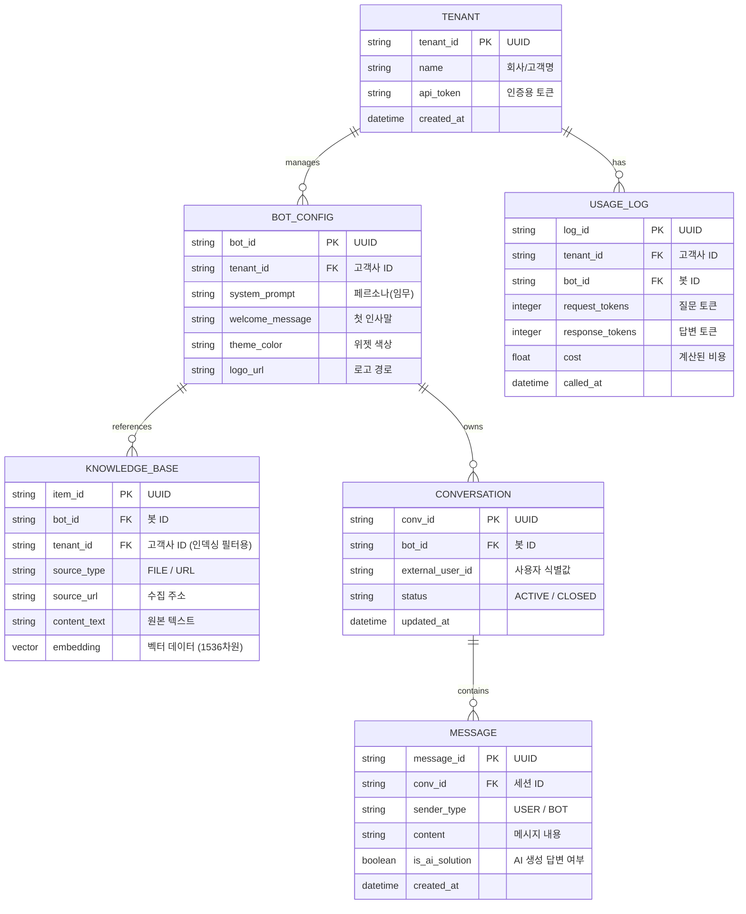

# 챗봇 빌더 데이터베이스 ER 다이어그램 (ERD)

멀티테넌트(Multi-tenant) 지원을 위해 설계된 챗봇 빌더용 DB 테이블 간의 관계도입니다.

## 1. 개체 관계도 (ER Diagram)

## 2. 주요 제약 조건 및 설계 특징

1.  **데이터 격리 (Data Isolation)**: 모든 주요 테이블(`BOT_CONFIG`, `KNOWLEDGE_BASE`, `CONVERSATION`)은 `tenant_id` 또는 `bot_id`를 외래키로 가집니다. 특히 벡터 검색을 수행하는 `KNOWLEDGE_BASE` 테이블은 `tenant_id` 필터를 통해 다른 고객사의 지식이 노출되지 않도록 강제합니다.
2.  **페르소나의 동적 관리**: `BOT_CONFIG` 테이블의 `system_prompt` 컬럼에 각 챗봇만의 고유한 정체성(예: 컴퓨터 전문가, 화난 친구 등)을 저장하며, 백엔드에서 런타임에 이를 로드합니다.
3.  **지식의 벡터화**: `KNOWLEDGE_BASE` 테이블의 `embedding` 컬럼은 실제 벡터 전용 DB(pgvector 등)에서 유사도 검색을 수행하는 핵심 필드입니다.
4.  **과금 데이터 추적**: `USAGE_LOG`를 통해 고객사별로 실시간 API 사용량을 집계하여 관리자 대시보드에서 통계를 제공합니다.
