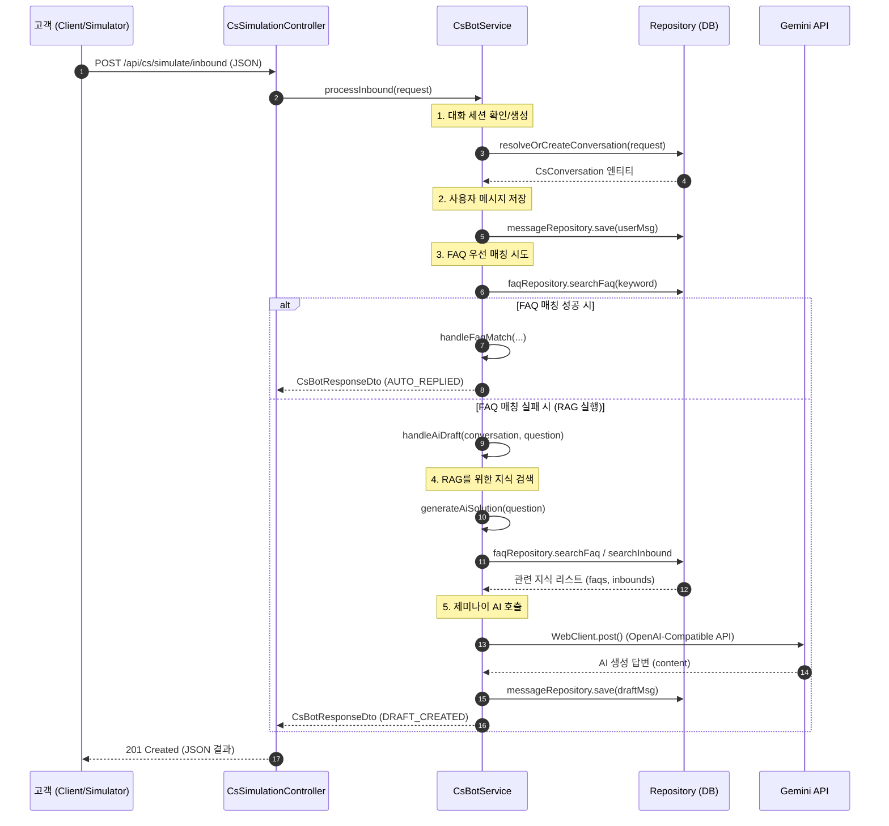

# 챗봇 요청 소스코드 흐름도 (Method Level)

고객의 문의가 유입되어 AI 답변이 생성되기까지의 구체적인 자바 메서드 호출 흐름입니다.

## 1. 문의 유입 및 처리 흐름 (Sequence Diagram)

## 2. 주요 클래스 및 메서드 역할

| 레이어 | 클래스명 | 핵심 메서드 | 역할 |
| :--- | :--- | :--- | :--- |
| **Controller** | `CsSimulationController` | `simulateInbound` | 외부 HTTP 요청의 진입점 |
| **Service** | `CsBotService` | `processInbound` | 전체 비즈니스 로직(세션, 메시지, RAG) 제어 |
| **Service** | `CsBotService` | `tryFaqMatch` | DB에 등록된 정적 FAQ와 일치하는지 확인 |
| **Service** | `CsBotService` | `generateAiSolution` | **[RAG 핵심]** DB 지식 검색 후 Gemini API 호출 |
| **Repository** | `CsFaqRepository` | `searchFaq` | 키워드 기반 FAQ 검색 (LIKE 쿼리) |
| **Repository** | `CsInboundDataRepository` | `searchInbound` | 과거 상담 처리 이력 검색 |

---
**Tip**: `e:\ws\mega\webserver\src\main\java\led\mega\cs\service\CsBotService.java` 파일을 열어보시면 위 흐름의 상세 로직을 확인하실 수 있습니다.
