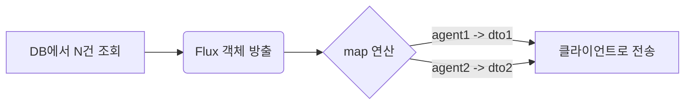
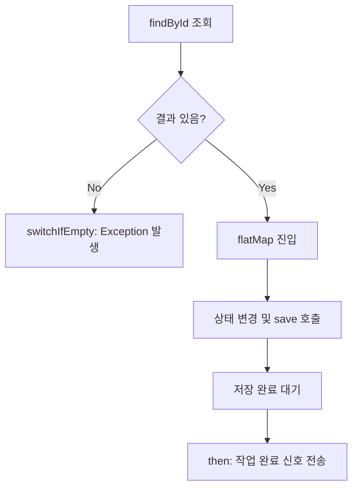
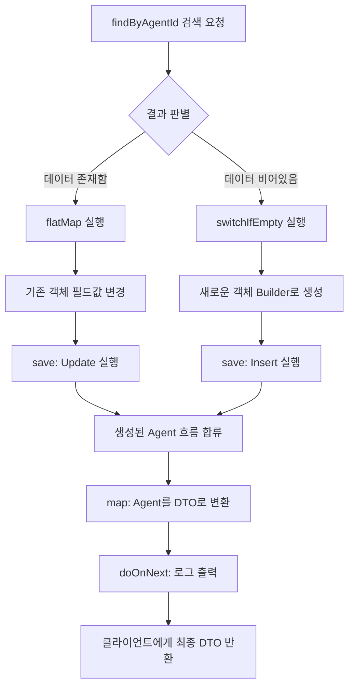

# Java Reactive (Project Reactor) 및 람다식 이해하기

현재 프로젝트(`AgentService.java`)에 적용된 코드를 바탕으로 Java Reactive의 핵심과 람다식(Lambda 표현식) 활용법을 난이도별로 분석했습니다.

## 💡 Reactive(반응형) 프로그래밍 핵심 요약
현재 백엔드는 **블로킹(Blocking) 방식에서 논블로킹(Non-blocking) 방식으로 전환**되어 있습니다. 데이터가 처리되는 흐름을 "스트림(Stream)"으로 다루며, 아래 형태를 가집니다.

- `Mono<T>`: **0개 또는 1개**의 결과를 반환 (단건 조회, 저장, 수정 등)
- `Flux<T>`: **0개부터 N개**의 결과를 반환 (목록 조회 등)
- `Mono<Void>`: 반환값 없이 끝나는 비동기 작업 (단순 업데이트 등)

람다식(`->`)은 전달된 데이터를 어떻게 변환(map)하거나 다음 작업으로 연결(flatMap)할지 정의하는 **함수 규칙**입니다.

---

## 🟢 1. 쉬운 로직 (Easy) : 단순 데이터 조회 및 변환

```java
// AgentService.java - getAllAgents() 함수
public Flux<AgentResponseDto> getAllAgents() {
    return agentRepository.findAll().map(this::toResponseDto);
    // 동일한 람다식 표현: agentRepository.findAll().map(agent -> toResponseDto(agent));
}
```

### 흐름 및 설명
- **데이터 소스**: DB(`agentRepository`)에서 모든 Agent를 가져오라고 요청합니다. 결과는 N개이므로 `Flux<Agent>`로 나옵니다.
- **데이터 변환 (`.map`)**: DB에서 전달되는 각각의 `agent` 데이터에 대해 `toResponseDto()` 함수를 적용하여 화면에 그리기 좋은 DTO 형태로 바꿉니다.
- **람다식 역할**: 스트림을 타고 흐르는 데이터를 하나씩 꺼내어 형태를 바꾸는(매핑) 단순 작업입니다.

### ⛓️ 동작 흐름도


---

## 🟡 2. 중간 로직 (Medium) : 조회 후 조건 검사 및 상태 업데이트

```java
// AgentService.java - updateStatus() 함수
public Mono<Void> updateStatus(Long agentId, AgentStatus status) {
    return agentRepository.findById(agentId)
            // 1. 에이전트가 없으면 에러 발생
            .switchIfEmpty(Mono.error(new IllegalArgumentException("에이전트를 찾을 수 없습니다.")))
            // 2. 에이전트가 있으면 상태값을 변경 후 저장 (DB 저장도 비동기 작업이므로 flatMap 사용)
            .flatMap(agent -> {
                agent.setStatus(status);
                return agentRepository.save(agent); // 리턴 타입이 Mono<Agent>
            })
            // 3. 작업이 모두 끝난 뒤 결과값은 무시하고 Mono<Void> 로 반환
            .then();
}
```

### 흐름 및 설명
- **`.switchIfEmpty`**: 데이터가 비어있을 경우(ID에 해당하는 에이전트가 없음) 대체 흐름을 제공합니다. 여기서는 `Mono.error()`를 발생시킵니다. 기존 블로킹 코드의 `if (agent == null) throw Exception` 역할을 합니다.
- **`.flatMap`**: `.map`과 달리, 람다식의 실행 결과가 **또 다른 Reactive 타입(Mono/Flux)**일 때 사용합니다. `save()` 메소드는 DB 작업을 수행하고 `Mono<Agent>`를 반환합니다. 그냥 `.map`을 쓰면 `Mono<Mono<Agent>>`처럼 중첩되므로, 이를 평평하게(flat) 풀어주기 위해 `.flatMap`을 씁니다.
- **`.then()`**: 앞의 모든 비동기 작업이 완료되기를 기다렸다가, 반환값을 버리고 "완료 신호"만 보내는 `Mono<Void>`로 바꿉니다.

### ⛓️ 동작 흐름도


---

## 🔴 3. 어려운 로직 (Hard) : 조건 분기 (UPSERT - 있으면 수정, 없으면 생성)

```java
// AgentService.java - registerAgent() 함수
public Mono<AgentRegisterResponseDto> registerAgent(AgentRegisterDto registerDto) {
    return agentRepository.findByAgentId(registerDto.getAgentId())
            // 1. 기존 데이터가 존재할 경우 흐름
            .flatMap(existingAgent -> {
                existingAgent.setName(registerDto.getName());
                // ... (필드 업데이트 생략)
                existingAgent.setStatus(AgentStatus.ONLINE);
                return agentRepository.save(existingAgent);
            })
            // 2. 기존 데이터가 없을 경우 흐름 (flatMap을 타지 않고 바로 여기로 옴)
            .switchIfEmpty(Mono.defer(() -> {
                Agent agent = Agent.builder()
                        .agentId(registerDto.getAgentId())
                        // ... (초기값 세팅 생략)
                        .status(AgentStatus.ONLINE)
                        .lastHeartbeat(LocalDateTime.now())
                        .build();
                return agentRepository.save(agent);
            }))
            // 3. 위의 둘 중 어느 쪽을 탔든, 결과로 나온 Agent를 DTO로 변환
            .map(saved -> AgentRegisterResponseDto.builder()
                    .id(saved.getId())
                    .status(saved.getStatus())
                    .build())
            // 4. 로깅 등 부수적인 작업(Side-effect) 수행
            .doOnNext(r -> log.info("에이전트 등록 완료: agentId={}", r.getAgentId()));
}
```

### 흐름 및 설명
이 로직은 "있으면 Update, 없으면 Insert"를 논블로킹 방식으로 구현한 고급 패턴입니다.

1. **`.flatMap`**: DB에서 에이전트를 찾으면 이 블록이 실행됩니다. 필드를 갱신하고 `save()`를 호출해 덮어씌웁니다.
2. **`.switchIfEmpty(Mono.defer(...))`**: DB에서 에이전트를 못 찾으면 위 `flatMap`은 건너뛰고 이 블록이 실행됩니다. 여기서 새 Entity를 만들고 DB에 `save()` 합니다.
   - 💡 **`Mono.defer`의 중요성**: `defer`는 "해당 상황(Empty)이 일어날 때까지 생성을 지연(게으른 실행)"시킵니다. 만약 `defer` 없이 작성하면 기존 에이전트가 존재하더라도 신규 객체 생성 로직이 먼저 실행되어 메모리가 낭비됩니다.
3. **병합 후 `.map` 처리**: 수정되었든 생성되었든, 흐름의 다음 단계로는 저장된 `Agent` 객체가 전달됩니다. 여기서 `map`을 통해 최종 DTO로 변환합니다.
4. **`.doOnNext`**: 데이터 흐름을 변경하지 않으면서, 지나가는 데이터를 엿보고 추가 작업(여기서는 로그 출력)을 할 때 사용합니다.

### ⛓️ 동작 흐름도


## 핵심 요약
- `.map(데이터 -> 변환데이터)`: 데이터를 단지 형태만 바꿀 때
- `.flatMap(데이터 -> Mono/Flux)`: 데이터베이스 연동처럼 결과가 다시 리액티브 스트림인 작업을 연결할 때
- `.switchIfEmpty(...)`: `if (data == null)`를 대체하는 우아한 방법
- `.doOnNext(...)`: 본 작업에 영향을 주지 않고 로그를 남길 때
